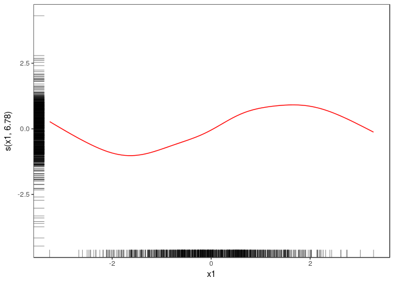
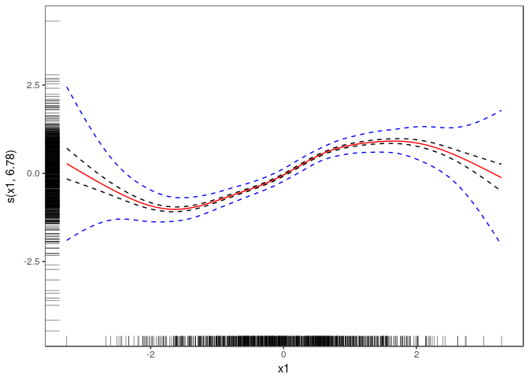
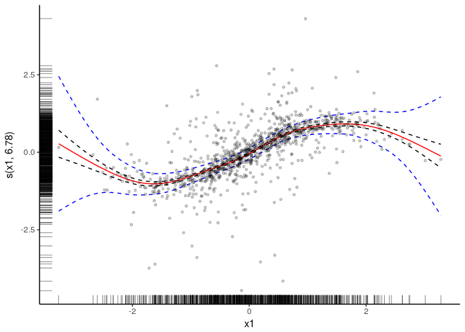
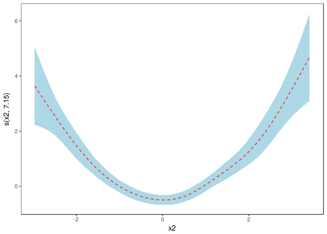
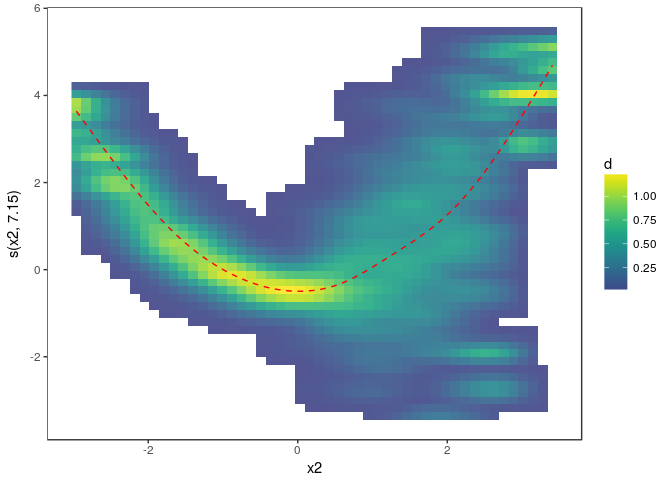

**mgcViz**: visual tools for modern Generalized Additive Models
===============================================================

This R package offers visual tool for Generalized Additive Models
(GAMs). So far `mgcViz` provides: 1. Layered smooth effect plots. The
plots provided by `mgcv::plot.gam` have been re-written in `ggplot2`. 2.
New layered model checks

The main fitting functions are:

-   `qgam()` fits an additive quantile regression model to a
    single quantile. Very similar to `mgcv::gam()`. It returns an object
    of class `qgam`, which inherits from `mgcv::gamObject`.
-   `mqgam()` fits the same additive quantile regression model to
    several quantiles. It is more efficient that calling `qgam()`
    several times, especially in terms of memory usage.
-   `tuneLearn()` useful for tuning the learning rate of the
    Gibbs posterior. It evaluates a calibration loss function on a grid
    of values provided by the user.
-   `tuneLearnFast()` similar to `tuneLearn()`, but here the learning
    rate is selected by minimizing the calibration loss, using
    Brent method.

A first example: smoothing the motorcycle dataset
=================================================

Let's start with a simple example. Here we are fitting a regression
model with an adaptive spline basis to quantile 0.8 of the motorcycle
dataset.

    library(mgcViz)
    n  <- 1e3
    x1 <- rnorm(n)
    x2 <- rnorm(n)
    dat <- data.frame("x1" = x1, "x2" = x2,
                      "y" = sin(x1) + 0.5 * x2^2 + pmax(x2, 0.2) * rnorm(n))
    b <- bam(y ~ s(x1)+s(x2), data = dat, method = "fREML", discrete = TRUE)
    b <- getViz(b)

    o <- plot( sm(b, 1) ) 

    # Plot with fitted effect + rug on both axis
    ( o <- o + l_fitLine(colour = "red") + 
        l_rug(mapping = aes(x=x, y=y), alpha = 0.8) )

    # Add CI lines at 1*sigma and 5*sigma
    ( o <- o + l_ciLine(mul = 1) + l_ciLine(mul = 5, colour = "blue", linetype = 2) )

    # Add partial residuals and change theme
    ( o + l_points(shape = 19, size = 1, alpha = 0.2) + 
        wrapTheme(theme_classic()) )

    # Get second effect plot
    o2 <- plot( sm(b, 2) )

    # Plot it with polygon for partial residuals
    o2 + l_ciPoly(mul = 5, fill = "light blue") + 
      l_fitLine(linetype = 2, colour = "red")

    # Plot is with conditional density of partial residuals
    o2 + l_dens(type = "cond", alpha = 0.9)  + 
      l_fitLine(linetype = 2, colour = "red")

References
==========

-   Wickham, H. (2010) A layered grammar of graphics, Journal of
    Computational and Graphical Statistics, 19, 3–28.
